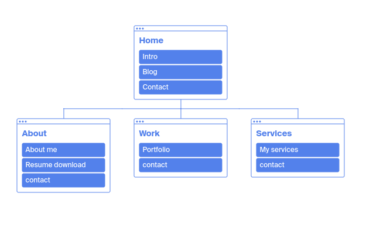

Published portfolio website: 
https://ruddoll.github.io/Portfolio-Website/

GitHub repo: 
https://github.com/Ruddoll/Portfolio-Website

Presentation video:
https://drive.google.com/file/d/1mC8ZgceC136ZwQXIqRWNo-Cwjx39bbr9/view?usp=share_link


## Description of Website

My portfolio website is a special way for me to present my work and introduce myself to others. It's intended to serve as an evergreen platform for all of my projects, case studies, and information about who I am and what I can offer.

The website is made primaraly with HTML and CSS. JS was used to create the hamburger menu. The site was deployed with github pages.

The website makes use of buttons, animations and transitions to provide a smooth and comfortable navigation expirience for the viewer.

## Sitemap



```html
<?xml version="1.0" encoding="UTF-8"?>
<urlset
      xmlns="http://www.sitemaps.org/schemas/sitemap/0.9"
      xmlns:xsi="http://www.w3.org/2001/XMLSchema-instance"
      xsi:schemaLocation="http://www.sitemaps.org/schemas/sitemap/0.9
            http://www.sitemaps.org/schemas/sitemap/0.9/sitemap.xsd">
<!-- created with Free Online Sitemap Generator www.xml-sitemaps.com -->


<url>
  <loc>https://ruddoll.github.io/Portfolio-Website/index.html</loc>
  <lastmod>2022-11-14T09:17:14+00:00</lastmod>
  <priority>1.00</priority>
</url>
<url>
  <loc>https://ruddoll.github.io/Portfolio-Website/pages/about.html</loc>
  <lastmod>2022-11-14T09:17:14+00:00</lastmod>
  <priority>0.80</priority>
</url>
<url>
  <loc>https://ruddoll.github.io/Portfolio-Website/pages/work.html</loc>
  <lastmod>2022-11-14T09:17:14+00:00</lastmod>
  <priority>0.80</priority>
</url>
<url>
  <loc>https://ruddoll.github.io/Portfolio-Website/pages/services.html</loc>
  <lastmod>2022-11-14T09:17:14+00:00</lastmod>
  <priority>0.80</priority>
</url>
<url>
  <loc>https://ruddoll.github.io/Portfolio-Website/documents/Moyo's%20Resume.pdf</loc>
  <lastmod>2022-11-14T09:17:14+00:00</lastmod>
  <priority>0.64</priority>
</url>


</urlset>
```